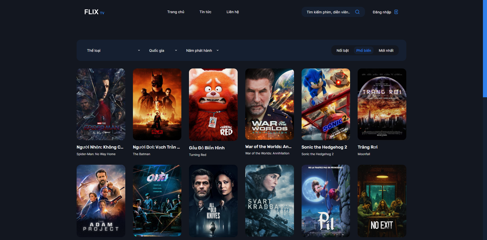

## Laravel Movie

Mã nguồn Movie single page application.

Công nghệ sử dụng:
- Laravel
- Vue.js
- Inertia.js

## Hướng dẫn sử dụng

- Clone to your local machine
- `cd` to the project
- Config `APP_URL` in `.env` file
- Run `composer install` and `npm install`
- Run `npm run dev` to generate bundle `css, js` files
- If run in `production`, run `npm run production`

## License

The Laravel framework is open-sourced software licensed under the [MIT license](https://opensource.org/licenses/MIT).
